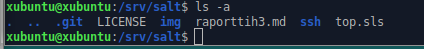

# Palvelinten hallinta ict4tn022-3002 viikko 3
Klo 7:42

Alla kurssisivulla (http://terokarvinen.com/2018/aikataulu-%E2%80%93-palvelinten-hallinta-ict4tn022-3004-ti-ja-3002-to-%E2%80%93-loppukevat-2018-5p#h3) annetut harjoitus tehtävät, jotka suoritan tässä raportissa.
>>	# H3
>*	a) Opiskele yllä aikataulussa olevat artikkelit. Noissa artikkeleissa opetetaan ne asiat, joilla läksyt saa tehtyä. Tätä a-kohdan lukutehtävää ei tarvitse raportoida. Luettava materiaali on kunkin tapaamiskerran kohdalla.
>*	b) MarkDown. Tee tämän tehtävän raportti MarkDownina. Helpointa on tehdä raportti samaan GitHub-varastoon kuin Salt-modulit. Tiedostoon .md-pääte. Tyhjä rivi tekee kappalejaon, risuaita ‘#’ tekee otsikon, sisennys merkitsee koodinpätkän.
>*	c) Laita /srv/salt/ gittiin. Tee uusi moduli. Kloonaa varastosi toiselle koneelle (tai poista /srv/salt ja palauta se kloonaamalla) ja jatka sillä.
>*	d) Näytä omalla salt-varastollasi esimerkit komennoista ‘git log’, ‘git diff’ ja ‘git blame’. Selitä tulokset.
>*	e) Tee tyhmä muutos gittiin, älä tee commit:tia. Tuhoa huonot muutokset ‘git reset –hard’. Huomaa, että tässä toiminnossa ei ole peruutusnappia.
>*	f) Tee uusi salt-moduli. Voit asentaa ja konfiguroida minkä vain uuden ohjelman: demonin, työpöytäohjelman tai komentokehotteesta toimivan ohjelman. Käytä tarvittaessa ‘find -printf “%T+ %p\n”|sort’ löytääksesi uudet asetustiedostot.

Tehtäviä suoritan Lenovo Thinkpad E570-kannettavalla, jossa käyttöjärjestelmänä käytän live tikulla pyörivää Linux Ubuntua(Ubuntu 18.04.1 LTS \n \l). Koneen sisältö "sudo lshw -short -sanitize" komenolla on seuraava:


Alkutoimina suoritin koneessa komennot joilla näppäimistön saa tukemaan suomenkieltä, päivitin pakettivarastot ja asensin Shutterin kuvakaappauksia varten.
```
$ setxkbmap fi
$ sudo apt-get update
$ sudo apt-get install shutter
```

# C) Laita /srv/salt/ gittiin. Tee uusi moduli. Kloonaa varastosi toiselle koneelle (tai poista /srv/salt ja palauta se kloonaamalla) ja jatka sillä.
Tehtävänannon lähde mainittu alussa. 
Klo 11:26

Olin jo tunnilla luonut GitHubiin "tyhjän" salt-repositoryn (kansion), joten en lähtenyt tällä kertaa poistamaan ja tekemään uudestaaan. Sen sijaan asensin koneeseen gitin ja kloonasin salt-kansion gitistä oman koneen /srv/-kansioon.
```
$ sudo apt-get install git
$ cd /srv
$ sudo git clone https://github.com/JarnoWer/salt
```
Seuraavaksi menin salt kansiioon ja annoin gitille käyttäjätietoni (sähköposti ja käyttäjänimi). Näiden toimien jälkeen loin raportille tämän tiedoston ja aloin harjoitella markdownin käyttöä kirjoittamalla raporttia ensimmäiseen kuvaan asti. Kuvan lisäyksen ohjeen löysin osoitteesta https://community.atlassian.com/t5/Bitbucket-questions/How-to-add-images-to-Readme-md/qaq-p/541434. Tallensin raportin ja suoritin git varaston päivitykset nähdäkseni toimiiko tekemäni markdown muotoilut. Muotoiluja piti muokkailla useaan kertaan, jotta sain muotoilut mieleisekseni hyvät ohjeet löytyivät sivulta https://en.support.wordpress.com/markdown-quick-reference/. Muotoiluja muokatessa suoritin git päivitykset useaan kertaan yhdistämällä kommennot, olisi varmaankin ollut hyvä poistaa virheelliset päivitykset git reset komennolla, mutta en vielä tässä vaiheessa ollut harjoitellut sitä. Lisäksi aika nopeasti kopioin Tero Karvisen ohjeesta (http://terokarvinen.com/2016/publish-your-project-with-github) komennon millä salasana kyselyn saa pidemmällä välillä. 
 
```
$ cd salt
$ git config --global user.email "jarno.wermundsen@myy.haaga-helia.fi"
$ git config --global user.name "Jarno Wermundsen"
$ sudoedit raporttih3.md
$ sudo git add .
$ sudo git commit
$ sudo git pull
$ sudo git push
$ sudoedit raporttih3.md
$ sudo git add .; sudo git commit; sudo git pull; sudo git push
$ git config --global credential.helper "cache --timeout=3600"
```

## Tee uusi moduli (Ensi vaiheet)
Klo 12:27

Teen modulin, joka asentaa ssh-serverin ja vaihtaa käytettävän portin. Aloitin asentamalla konelle openssh-server ohjelman ja muokkasin sen config tiedostosta uudeksi yhteysportiksi 9595(kuva alla). Käynnistin ssh:n uudelleen, vaihdoin käyttäjän salasanan ja kokelin yhteydenottoa samalta koneelta samalle koneelle. Mikä onnistui(kuva alla).
```
$ sudo apt-get install openssh-server 
$ sudoedit /etc/ssh/sshd_config 
$ sudo service ssh restart
$ hostname -I
$ passwd
$ ssh -p 9595 xubuntu@192.168.10.50 
```


### Salt asennus
Klo 13:10

Taas kerran aloitetaan asentamalla salt. Tällä kertaa asensin masterin ja minionin samalle koneelle. Muokkasin minion asetustiedostosta koneelle masterin ja id:n(kuva alla). Käynnistin salt-minionin uudelleen ja hyväksyin avaimen. 
```
$ sudo apt-get install salt-minion salt-master
$ echo " " |sudo tee /etc/salt/minion 
$ sudoedit /etc/salt/minion
$ sudo systemctl restart salt-minion.service 
$ sudo salt-key -A
```


### Modulin tekeminen
Klo 13:35

Aloitin luomalla salt kansioon ssh kansion, jonne kopioin muokatun ssh asetustiedoston. Seuraavaksi tein top.sls tiedoston johon lisäsin kaikille minioneille asennettavaksi ssh modulin(kuva tiedostosta alla). Sitten tein saltin ssh-kansioon init.sls tiedoston, johon kirjasin asennettavaksi openssh-serverin ja kopioitavaksi ja vahdittavaksi asetus tiedoston(kuva tiedostosta alla).  
```
$ sudo mkdir ssh
$ sudo cp /etc/ssh/sshd_config /srv/salt/ssh/
$ sudoedit top.sls
$ sudoedit ssh/init.sls
```


### Modulin testaaminen
Klo 13:54

Testatakseni moduulia poistin openssh-serverin ensin kokonaan koneelta ja varmistin että yhteyttä ei saa muodostettua. Varmistin vielä, että sshd_config tiedostoa ei löydy koneen asetustiedostoista(kuva alla). Ajoin minionit highstateen, mikä näytti raportin mukaan onnistuvan(summary kuva alla). Testasin vielä, että ssh-yhteyden saa taas porttiin 9595, jolloin ilmeni että vanhan istunnon avain täytyy ensin poistaa(kuva alla). Poistin vanhan istunnon avaimen ja kokeilin vielä kerran jolloin yhteys toimi(kuva alla).
```
$ sudo apt-get purge openssh-server
$ ssh -p 9595 xubuntu@192.168.10.50
$ ls /etc/ssh/
$ sudo salt '*' state.highstate
$ ssh -p 9595 xubuntu@192.168.10.50
$ ssh-keygen -f "/home/xubuntu/.ssh/known_hosts" -R "[192.168.10.50]:9595"
$ ssh -p 9595 xubuntu@192.168.10.50
```





## Kloonaa varastosi toiselle koneelle
Klo 15:37

Lyhyen tauon jälkeen käynnistin saman kannettavan uudestaan samalla livetikulla, jolloin kaikki äsken koneelle tekemäni muutokset hävisivät. Suoritin käynnistyksen jälkeen komennot, että sain näppäimistön suomeksi, tiedostopaketit päivitettyä, asennettua shutterin ja gitin. Sitten menin /srv-kansioon, johon kloonasin GitHubin salt-kansioni. Syötin gitille tietoni ja vähensin salasanakyselyitä. Lopuksi vielä tarkistin, että kansiossa tiedostot(kuva alla).
```
$ setxkbmap fi
$ sudo apt-get update 
$ sudo apt-get install shutter
$ sudo apt-get install git
$ cd /srv
$ sudo git clone https://github.com/JarnoWer/salt
$ git config --global user.email "jarno.wermundsen@myy.haaga-helia.fi"
$ git config --global user.name "Jarno Wermundsen"
$ git config --global credential.helper "cache --timeout=3600"
$ ls -a
```


#  d) Näytä omalla salt-varastollasi esimerkit komennoista ‘git log’, ‘git diff’ ja ‘git blame’. Selitä tulokset.
Tehtävänannon lähde mainittu alussa.
Klo 16:09

Seuraavaksi kokeilen tehtävänannossa mainitut komennot ja selitän mitä tulokset tarkoittavat.

## Git log

Annoin komennon git log /srv/salt-kansiossa ja otin kuvan ylimmästä eli uusimmasta merkinnästä(kuva alla). "commit a2a349d3c23207a50f33e0fefbbd04d4180bb24d" ensimmäinen kohta commit on sillä kertaa tallenettujen muutosten tiiviste. Author: kertoo muutosten tekijän tiedot, jotka annettu --global user.-komennoilla. Date: Kertoo muutosten ajankohdan UTC aikana ja alla oleva teksti on käyttäjän syöttämä selitys muutoksille. 
```
$ git log
```


## Git diff

Kokeilin taas antaa suoraan komennon, mutta tällä kertaa ei toiminut joten menin Git manuaalin internetsivulle (https://git-scm.com/docs/git-diff) tutkimaan komentoa. 
```
$ git diff

